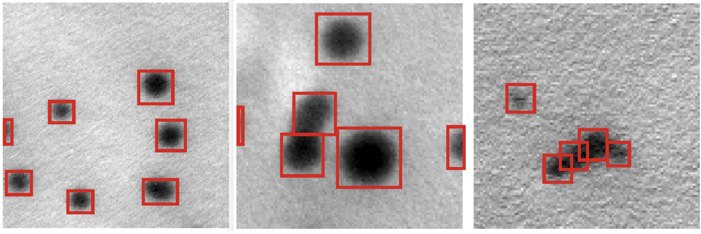

### Data origin

The original large TEM images are from several experimental situations. Three types of NPs were used: small iron oxide NP (≈ 11 nm diameter), a large silica NP (≈ 50 nm diameter) and a smaller NP (≈ 14 nm) mixed with a variety of matrices.

### Data Preprocessing

The large TEM images are cut into many small square images, each containing a few particles (less than 30). In each cutting, the dimension of small images, N × N pixels, are set by randomly chosing an integer N from [75, 375]. All the small images are then rescaled to 416 × 416 pixels such that particles appear to have different sizes across different samples. With this protocol, we arrive at a dataset of 279,057 labeled square images.

